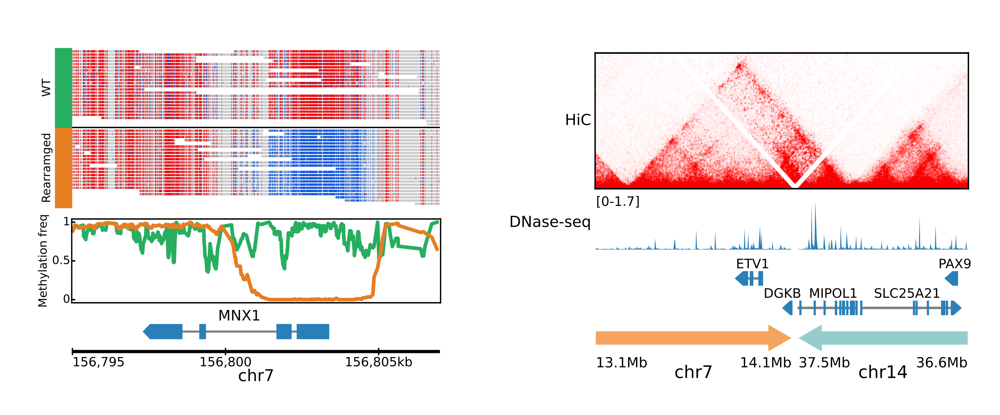

# figeno

```
  FIGENO is a
  FIGure
    GENerator
for GENOmics
```
With figeno, you can plot various types of sequencing data along genomic coordinates. Video overview: https://www.youtube.com/watch?v=h1cBeXoSYTA.


Example figures generated with figeno. Left: allele-specific methylation with nanopore data. Right: HiC data across a structural rearrangement. See more examples [here](https://figeno.readthedocs.io/en/latest/content/examples.html).

## Features
- Large collection of tracks (bigwig, HiC, alignments with base modifications, WGS with copy numbers and SV…)
- Multi-region figures with interactions across regions
- Graphical user interface, command line interface and python API
- Output figures in vector graphics (svg, pdf) or bitmap (png)

## Quick start
### Linux, MacOS
In an environment with python>=3.7:
```
pip install figeno
figeno gui
```
This will install figeno and run the graphical user interface (GUI). From the GUI, you can configure the figure and generate it, as well as save the JSON config file which fully defines the figure. The GUI is optional and you can instead use the command line interface: use [figeno init](https://figeno.readthedocs.io/en/latest/content/usage.html#figeno-init) to initialize a config file, edit the config file manually, and generate the figure with [figeno make](https://figeno.readthedocs.io/en/latest/content/usage.html#figeno-make).

### Windows
Download figeno_windows.zip from https://github.com/CompEpigen/figeno/releases/latest, unzip it and launch the graphical user interface by executing `figeno.exe`.

## Documentation
For more information on how to use figeno, please read the documentation at 
https://figeno.readthedocs.io/en/latest/.

## Test data
Example input files to test figeno are provided in [test_data](https://github.com/CompEpigen/figeno/tree/main/test_data).

## Feedback
If you encounter a bug or would like to have a new feature added, please do not hesitate to [raise an issue](https://github.com/CompEpigen/figeno/issues/new) or to [contact me directly](https://www.dkfz.de/en/CanEpi/staff/kontakt/Sollier_Etienne.php). You can also provide feedback by completing this [anonymous form](https://forms.gle/xb9Ygk6zsJCJUQYm9), which would help me improve figeno!

## Citation
If you use figeno in your research, please consider citing:

Etienne Sollier, Jessica Heilmann, Clarissa Gerhauser, Michael Scherer, Christoph Plass, Pavlo Lutsik. Figeno: multi-region genomic figures with long-read support, Bioinformatics 2024. [https://doi.org/10.1093/bioinformatics/btae354](https://doi.org/10.1093/bioinformatics/btae354)

