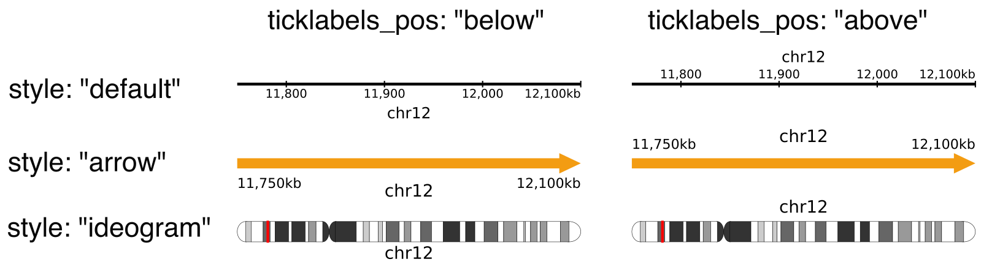
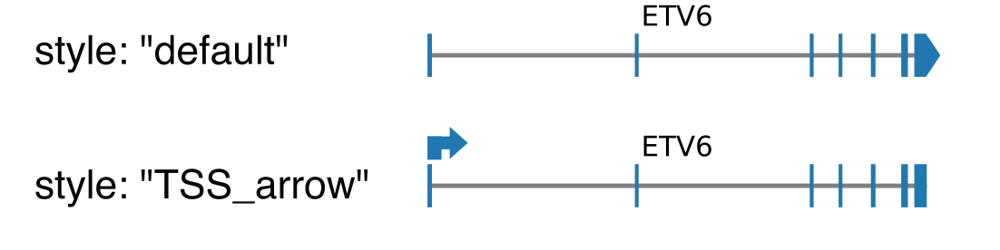
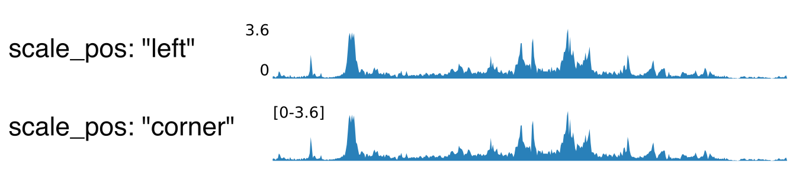
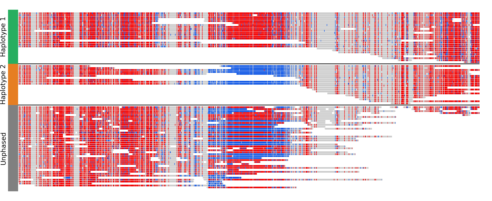
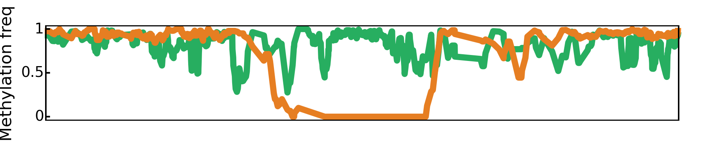

.. _describingFigure:

Describing the figure
==================================

The figure is characterized by a config file in json format, which is made up of 5 sections: :ref:`General`, :ref:`Output`, :ref:`Regions`, :ref:`Highlights` and :ref:`Tracks`.
    
General
-------

* ``layout``: 

  * ``horizontal``: Draw all regions one after the other horizontally
  
  * ``circular``: Draw all regions one after the other in a circle
  
  * ``symmetrical``: Draw the regions in two rows, such that the tracks are symmetric: the bottom row has the tracks in the normal order, but the top row has its tracks in the reverse order. This is mainly intended to show copy numbers and breakpoints, with sv as the topmost track.
  
  * ``stacked``: Draw all regions horizontally, but instead of being next to each other horizontally, the different regions are stacked vertically.
* ``reference``: Reference genome used. Files for hg19, hg38 and mm10 are provided. You can also choose a custom reference genome, but then you will need to provide the required files: 

  * ``genes_file``: only required if you use a "genes" track, or if you want to highlight genes in a "copynumber" track. Should be in NCBI RefSeq format, which you can download for any reference genome from the  `UCSC table browser <https://genome.ucsc.edu/cgi-bin/hgTables>`_ (Group: Genes and Genes Predictions, track: NCBI RefSeq, table: RefSeq All, output field separator: tsv, file type returned: gzip compressed). See `example here <https://github.com/CompEpigen/figeno/blob/main/figeno/data/hg19_genes.txt.gz>`_. Alternatively, gtf and gff3 files are also supported (but a bit slower).
  
  * ``cytobands_file``: only required if you use a "chr_axis" track with the "ideogram" style, or if you do not specify the end of a region (in which case the region is assumed to go until the end of the chromosome), or if you want to use the "add all chromosomes functionality. The file can be downloaded for any genome from the `UCSC table browser <https://genome.ucsc.edu/cgi-bin/hgTables>`_ (Group: Mapping and Sequencing, track: Chromosome Band (Ideogram), table: cytoBandIdeo, output field separator: tsv, file type returned: plain text). See `example here <https://github.com/CompEpigen/figeno/blob/main/figeno/data/hg19_cytobands.tsv>`_. Alternatively, you can provide a fasta index (.fai) in order to provide the chromosome lengths, but this will not be sufficient to plot ideograms.

Output
-------

* ``file``: Path to the output file. The format will be inferred from the file extension
* ``dpi``: Higher values will result in higher resolution but larger file size. Even if the figure is saved as vector graphics, this parameter will still have an importance for the hic and alignments tracks because they are rasterized.
* ``width``: Width of the figure in mm. The default is 180mm, which is a standard full-page figure.

Regions
-------

Regions are defined by chr, start and end. If end<start, the region will be shown in reverse orientation (from right to left). If start is not provided, it will be assumed to be 0. If end is not provided, it will be assumed to be the length of the chromosome. The color attribute will only be used if a chr axis track with style "arrow" is used. At least one region must be provided, but a key feature of figeno is that it allows several regions to be displayed at the same time. Tracks will be displayed independently for each region, except for:

* hic tracks if show_interactions_across_regions is set to True, in which case interactions will be shown across regions.
* sv tracks which can show breakpoints across regions.
* alignments tracks if link_splitreads is True, in which case all all alignments of a read will be linked, if the read has supplementary alignments.
* for bigwig and coverage tracks, if the scale is set to "auto" (and not "auto per region"), the same scale will be used for all regions.

Highlights
----------

Optionally, highlight some areas defined by chr, start and end, for example peaks.

Tracks
------

General parameters which can be applied to all tracks:

* ``height``: height of the track in mm.

* ``margin_above``: margin above the track, in mm. For circular layouts, this is the margin between this track and the one closer to the center.

* ``bounding_box``: if True, will display a black bounding box around the track.

* ``fontscale``: lower (resp. higher) values will make the fonts for this track smaller (resp. higher).

* ``label``: Name of the track, written to the left of the track. If you want to write your label on multiple lines, you can use the linebreak symbol: \n .

* ``label_rotate``: if false, the label is written horizontally. Otherwise, it will be written vertically.

chr_axis
^^^^^^^^

Track showing the chromosome coordinates in the region.

Parameters:

* ``style``

  * ``default``: draw a black line with ticks alongside it.
  
  * ``arrow``: draw an arrow, colored according to the color of the region. Only the start and end of the region will be shown, no intermediate ticks.
  
  * ``ideogram``: draw an ideogram for the whole chromosome, and highlight in red the position of the region within the chromosome

* ``lw_scale``: Scale for the linewidth of the chromosome axis, or for the height of the arrow/ideogram (default: 1.0).
  
* ``ticklabels_pos``: The default is "below" meaning the text is below the axis, which is best suited when the axis is at the bottom of the plot. Alternatively, it can be set to "above" if the axis is at the top of the figure, or "none" to remove the ticks.

* ``unit``: bp, kb or Mb (default: kb). 
  
* ``ticks_interval``: Number of base pairs between ticks. The default is "auto", which will automatically choose this value depending on the size of the regions and the figure width, but you can also set this to a custom value, e.g. 5000 if you want ticks every 5kb.

* ``ticks_angle``: Angle in degrees at which the ticks are written. The default (0) results in horizontal ticks, but you can also tilt them by increasing this value to e.g. 30. Rotating the ticks might result in them overlapping with the chromosome name, so you might want to post-process the figure in a vector graphics editor by manualling moving the chromosome name in case of overlap.

genes
^^^^^  

Track showing genes.

Parameters:

* ``style``

  * ``default``: draw exons as rectangle, except the last one which is an arrow indicating the orientation of the transcript.
  
  * ``TSS_arrow``: draw exons as rectangle, and add an arrow above the TSS indicating the orientation. Best suited when only one gene is shown.
  
* collapsed: if true (default), all transcripts corresponding to the same gene will be shown together, otherwise there will be one line per transcript.

* only_protein_coding: if true (default), only show protein coding genes. Otherwise, show all genes found in the region.
  
* ``exon_color``: choose the color of the exons.

* ``genes``: "auto" by default, meaning that all genes found in the region will be shown. Alternatively, you can specify a comma-separated list of gene names that you want to show, eg: ETV6,BCL2L14,LRP6

* ``show_gene_names``: if True (default), show the gene names. You may want to remove gene names when you display large regions with many genes.

.. warning::
  The gene names might overlap. If this is the case, you can try to increase the height of the figure (if the genes are split over several rows), to only show the names of specific genes (with the genes paramater), to remove gene names, or to save the figure in vector graphics format (svg or pdf) and post-process it by manually moving the gene names.

bed
^^^^^^^^

The bed file must contain as first three columns (tab-separated): chr, start and end. Each region specified in the bed will be shown as a rectangle.

Parameters:

* ``file``: path to the bed file.

* ``color``: color for the rectangles.

* ``show_names``: if True, will display the name of each region above the corresponding rectangle. This requires that the bed file contains a fourth column indicating the name of each region.

bigwig
^^^^^^^^

Track showing data stored in a bigwig file (eg ChIPseq, ATACseq...).

Parameters:

* ``n_bins``: indicate the number of windows in which the signal will be averaged. A high number will result in narrower peaks with more frequent variation.

* ``color``: color of the track.

* ``scale``: how the maximum value for the y-axis is chosen

  * ``auto`` (default): will select as maximum the maximum across all regions.
  
  * ``auto per region``: will select as maximum the maximum of each region (so a different scale is used for each region)
  
  * ``custom``: manually specify the maximum value. Can either specify a single value, which will then be used for all regions, or a comma-separated list of values (one per region)

* ``scale_max``: in case "scale" is "custom", indicate the maximum value for the y-axis.
  
* ``scale_pos``: where the scale (min and max value of the y-axis) will be displayed

  * ``left``: on the left of the track
  
  * ``corner``: in the top-left corner of the track, only for the first region
  
  * ``corner all``: in the top-left corner of the track, for all regions (only option available if you use different scales for each region)
  
  * ``none``: do not show the scale
  
* ``upside_down``: if true, the track will be upside down.

hic
^^^^^^^^

Track showing chromatin interactions from HiC data in cool format.

.. image:: images/figure_hic.png 

Parameters:

* ``file``: file in cool or mcool format. If a mcool file is provided, you should specify the resolution by setting file to: "path/to/file.mcool::resolutions//xxxxx" 

* ``color_map``: how the interaction values are mapped to colors.

  * ``Red`` (default): red indicates strong interactions and white absence of interactions
  
  * ``Heat``: red indicates strong interactions and dark blue absence of interactions
  
* ``pixel_border``: If true, add a black border around each pixel.

* ``upside_down``: By default, long-distance interactions are shown at the top. Setting this to True will show long-distance interactions at the bottom, resulting in triangles whose summits face down. This can be useful to show HiC data for two samples from the same region: one sample can be shown at the top in normal orientation, and the other sample can be displayed at the bottom in upside-down orientation.

* ``max_dist``: maximum genomic distance between bins where interactions are shown
  
* ``extend``: if True (default), also show interactions from bins within regions to bins outside regions, as opposed to only interactions to and from bins within regions (which results in a lot of unused space outside of the triangle).

* ``interactions_across_regions``: if True (default), will show interactions occurring across different regions (only relevant if more than one region is used, and typically if the regions are joined by a genomic rearrangement). Otherwise, only show interactions occuring within the region.

* ``double_across_regions``: if True (default), the interaction score for two bins from different regions will be doubled. Intra-region interactions typically occur on both copies whereas inter-region interactions only occur on the rearranged copy, so this can be used to counter this effect.

.. warning::
  Only .cool and .mcool files are supported. If you have .hic files, please convert them to cool using https://hicexplorer.readthedocs.io/en/latest/content/tools/hicConvertFormat.html.

coverage
^^^^^^^^

Track showing the coverage for a bam file.

Parameters:

* ``n_bins``: indicate the number of windows in which the signal will be averaged. A high number will result in narrower peaks with more frequent variation.

* ``color``: color of the track.

* ``scale``: how the maximum value for the y-axis is chosen

  * ``auto`` (default): will select as maximum the maximum across all regions.
  
  * ``auto per region``: will select as maximum the maximum of each region (so a different scale is used for each region)
  
  * ``custom``: manually specify the maximum value. Can either specify a single value, which will then be used for all regions, or a comma-separated list of values (one per region)
  
* ``scale_max``: in case "scale" is "custom", indicate the maximum value for the y-axis.
  
* ``scale_pos``: where the scale (min and max value of the y-axis) will be displayed

  * ``left``: on the left of the track
  
  * ``corner``: in the top-left corner of the track, only for the first region
  
  * ``corner all``: in the top-left corner of the track, for all regions (only option available if you use different scales for each region)
  
  * ``none``: do not show the scale

* ``upside_down``: if true, the track will be upside down.

alignments
^^^^^^^^^^

Tracks showing reads aligned in the region, from a bam file.

Parameters:

* ``file``: bam file, which must be indexed (eg a .bai file must also be present).

* ``hgap_bp``: minimum number of base pairs between two reads shown on the same row.

* ``vgap_frac``: fraction of the vertical space to use as gap between rows of reads (default: 0.3). You might want to lower this value when showing base modifications, or increase it if you want to show split reads.

* ``read_color``: color for the reads.

* ``link_splitreads``: whether or not to draw dashed lines linking all the alignments of a split read. If true, will also try to show all alignments from the same read on the same row.

  * ``only_show_splitreads``: if True and link_splitreads is True, will only show splitreads. Otherwise, show all reads.
  
  * ``splitread_color``: if link_splitreads is True, the color for splitreads.

  * ``link_color``: if link_splitreads is True, the color for the dashed line representing the link between two alignments of a splitread.

  * ``link_lw``: if link_splitreads is True, the linewidth for the dashed line representing the link between two alignments of a splitread (default: 0.2).
  
  * ``min_splitreads_breakpoints``: if link_splitreads is True, will only consider splitreads which correspond to a breakpoint supported by at least this number of splitreads (default: 2). This is used to filter splitreads not corresponding to an actual breakpoint.
  

* ``group_by``: none (default) or haplotype. Grouping by haplotypes requires the reads to be phased (with a HP tag). 

  * ``show_unphased``: when grouping by haplotype: whether to only show the reads phased to the two haplotypes, or also the unphased reads.
  
  * ``exchange_haplotypes``: when grouping by haplotype: by default (false), haplotype 1 is at the top. Setting this to true will put haplotype 2 at the top.
  
  * ``show_haplotype_colors``: when grouping by haplotype: whether or not to show a side panel on the left with colors for each group.
  
  * ``haplotype_colors``: when grouping by haplotype and show_haplotype_colors is true: list of colors for each haplotype.
  
  * ``haplotype_labels``: when grouping by haplotype: list of labels for each haplotype.
  
* ``color_by``: none or basemod. Coloring by base modification requires MM/ML tags in the bam file. Up to two different base modifications can be visualized at the same time (eg methylation and hydroxymethylation).

  * ``color_unmodified``: when coloring by base modification: color for the unmodified bases.

  * ``basemods``: when coloring by base modification: list of lists [base,mod,color] for each base modification, where base is for example "C" and mod "m" for cytosine methylation.
  
  * ``fix_hardclip_basemod``: the base modification in the MM/ML tags require the full read sequence, which is not provided in case of hard clipping (default for supplementary alignments with minimap2). If this is set to true, figeno will look for the primary alignment elsewhere in the bam file, and use its sequence to infer the methylation in the supplementary alignment. Otherwise, will simply not display the methylation status of hardclipped alignments. This option is somewhat experimental, and will slow down the generation of the figure.

.. warning::
  MM and ML tags are required in the bam file in order to color by base modifications. They should be included in the bam file automatically if you use dorado with a modified bases model.

basemod_freq
^^^^^^^^^^^^

Track showing base modification frequencies (e.g. methylation). The supported file types are:

* bam file with MM and ML tags (must be indexed).
* bedmethyl file (e.g. generated by modkit, with the format described `here <https://nanoporetech.github.io/modkit/intro_bedmethyl.html#bedmethyl-column-descriptions>`_). Bedmethyl files must be bgzip-compressed and indexed with tabix, which can be done with ``bgzip sample.bedmethyl`` and ``tabix -p bed sample.bedmethyl.gz``).
* bedgraph file: tab-separated file with no header and four columns: chr pos pos+1 basemodPercentage
* 3-column tsv file: tab-separated file with no header and three columns: chr pos basemodPercentage

Parameters:

* ``style``: "lines" (default) will plot a link all data points by a line. "dots" will show one dot per data point, which may be better for sparse data.

* ``smooth``: only applicable if style is "lines". If the value is 0, will simply show the raw base modification frequency at each position, which might result in ragged lines. If the value is x>0, the basemodification frequency will be averaged among the next x and previous x positions (but only if they are within 100bp of the original position). Default: 4.

* ``gap_frac``: only applicable if style is "lines". If two positions are separated by more than this value multiplied by the length of the region, the line will be split. This is to avoid long straight lines in places where there is no data. If you set this value to 1, there will always be a continous lines. Default: 0.1. 

* ``bams``: list of dictionaries with the following keys:
  
  * ``file``: path to a bam file with MM/ML tags.
  
  * ``base``: base for the base modification, e.g. C for cytosine.
  
  * ``mod``: modification, e.g. m for methylation or h for hydroxymethylation.
  
  * ``min_coverage``: minimum coverage at a position for the methylation frequency to be reported.
  
  * ``linewidth``: Width of the line showing the basemod frequency.
  
  * ``opacity``: Opacity of the line showing the basemod frequency.
  
  * ``fix_hardclip``: see fix_hardclip_basemod for alignments.
  
  * ``split_by_haplotype``: Whether or not to split by haplotype.
  
  * ``colors``: list of one (if split_by_haplotype is False) or two (if split_by_haplotype is True) colors for the lines showing the basemod frequency.

* ``bedmethyls``: list of dictionaries with the following keys:

  * ``file``: path to a bedmethyl file, a bedgraph file, or a 3-column tsv file (see above for details about these formats).
  
  * ``mod``: modification, e.g. m for methylation or h for hydroxymethylation.
  
  * ``min_coverage``: minimum coverage at a position for the methylation frequency to be reported.
  
  * ``linewidth``: Width of the line showing the basemod frequency.
  
  * ``opacity``: Opacity of the line showing the basemod frequency.
  
  * ``color``: Color of the line showing the basemod frequency.

sv
^^^^^^^^

Track with arcs showing structural variants. If only one of the two breakends is within a displayed region, then only a line will be drawn, with a label indicating the chromosome of the other breakend.

Parameters:

* ``file``: file containing the SV information. Can either be a vcf or a tsv file with at least the four columns: "chr1", "pos1", "chr2" and "pos2". For a tsv file, you can also provide the "strand1" and "strand2" columns in order to color SVs according to SV type (see below), or directly a "color" column, otherwise all SVs will be black.

* ``lw``: line width for the arcs showing the SVs. 

* ``color_del``, ``color_dup``, ``color_T2T``, ``color_H2H``, ``color_trans``: color of the arc representing the SV, depending on the SV type (respectively: deletion, duplication, tail-to-tail inversion, head-to-head inversion, translocation).

copynumber
^^^^^^^^^^

Track showing copy numbers, for WGS data. There is no standard format to represent this data, so currently figeno accepts the outputs of Control-FREEC (in which case it will draw dots showing the copy number of each bin) or purple (in which case it will show rectangles with the copy number of each segment), but you can also use other tools and convert your data to one of these formats.
Eiher freec_ratios and freec_CNAs, or purple_cn must be provided.

Parameters:

* ``freec_ratios``: tsv file containg at least the three columns: "Chromosome", "Start", "Ratio" (other columns will be ignored). Chromosome and start indicate the genomic position of the bin, and the copy number is ratio multiplied by ploidy. Rows with a ratio <0 will be ignored.

* ``freec_CNAs``: tsv file containing 5 columns without header. Each row indicates a copy number variant, where the columns indicate: chromosome, start, end, copy number, and the type of CNV ("gain" or "loss"). This will be used to color the dots from freec_ratios, or if freec_ratios is not provided, this will be used to plot copy number segments.

* ``purple_cn``: tsv file with the following columns: "chromosome", "start", "end", "copyNumber", "bafCount", and "baf".

* ``genes``: comma-separated list of genes to highlight.

* ``ploidy``: ploidy for the sample (default:2), only used if freec_ratios is used.

* ``min_cn``, ``max_cn``: minimum and maximum copy number to display. If not provided, will automatically set these values to fit all copy numbers in the regions displayed.

* ``marker_size``: size of the markers, if freec_ratios is provided (default: 0.7).

* ``color_normal``, ``color_loss``, ``color_gain``, ``color_cnloh``: colors for the dots or segments depending on CNV status. CNLOH (copy neutral loss of heterozygosity) is only used if purple_cn is provided.

* ``grid``: if True, might display horizontal and vertical lines (see below), depending on which of the other options are set.

* ``grid_major``, ``grid_minor``: whether or not to display vertical lines for major and minor ticks, respectively.

* ``grid_cn``: whether or not to display horizontal lines for each integer copy number.

