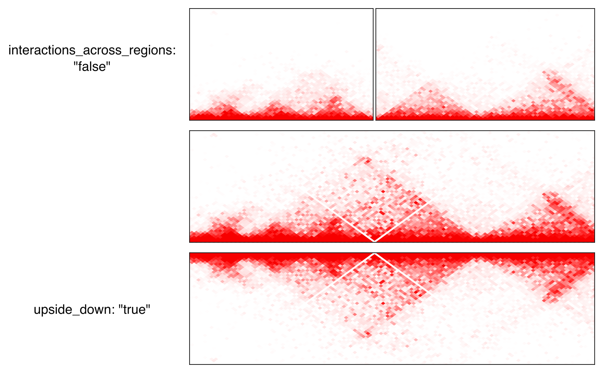

.. _describingFigure:

Describing the figure
==================================

The figure is characterized by a config file in json format, which is made up of 5 sections: :ref:`General`, :ref:`Output`, :ref:`Regions`, :ref:`Highlights` and :ref:`Tracks`.
    
General
-------

* **figure_layout**: 

  * **horizontal**: Draw all regions one after the other horizontally
  
  * **circular**: Draw all regions one after the other in a circle
  
  * **symmetric**: Draw the regions in two rows, such that the tracks are symmetric: the bottom row has the tracks in the normal order, but the top row has its tracks in the reverse order. This is mainly intended to show copy numbers and breakpoints, with sv as the topmost track.
  
  * **stacked**: Draw all regions horizontally, but instead of being next to each other horizontally, the different regions are stacked vertically.
* **reference**: Reference genome used. Files for hg19 and hg38 are provided. You can also choose a custom reference genome, but then you will need to provide the required files.

Output
-------

* **file**: Path to the output file. The format will be inferred from the file extension
* **dpi**: Higher values will result in higher resolution but larger file size. Even if the figure is saved as vector graphics, this parameter will still have an importance for the hic and alignments tracks because they are rasterized.
* **width**: Width of the figure in mm. The default is 180mm, which is a standard full-page figure.

Regions
-------

Regions are defined by chr, start and end. If end<start, the region will be shown in reverse orientation (from right to left). The color attribute will only be used if a chr axis track with style "arrow" is used. At least one region must be provided, but a key feature of figeno is that it allows several regions to be displayed at the same time. Tracks will be displayed independently for each region, except for:
* hic tracks if show_interactions_across_regions is set to True, in which case interactions will be shown across regions.
* sv tracks which can show breakpoints across regions.
* alignments tracks if link_splitreads is True, in which case all all alignments of a read will be linked, if the read has supplementary alignments.
* for bigwig and coverage tracks, if the scale is set to "auto" (and not "auto per region"), the same scale will be used for all regions.

Highlights
----------

Optionally, highlight some areas defined by chr, start and end, for example peaks.

Tracks
------

chr_axis
^^^^^^^^

* **style**

  * **default**: draw a black line with ticks alongside it.
  
  * **arrow**: draw an arrow, colored according to the color of the region. Only the start and end of the region will be shown, no intermediate ticks.
  
  * **ideogram**: draw an ideogram for the whole chromosome, and highlight in red the position of the region within the chromosome
  
* **unit**: bp, kb or Mb (default: kb). 

* **ticklabels_pos**: The default is "below" meaning the text is below the axis, which is best suited when the axis is at the bottom of the plot. Alternatively, it can be set to "above" if the axis is at the top of the figure, or "none" to remove the ticks.
  

genes
^^^^^  

* **style**

  * **default**: draw exons as rectangle, except the last one which is an arrow indicating the orientation of the transcript.
  
  * **TSS_arrow**: draw exons as rectangle, and add an arrow above the TSS indicating the orientation. Best suited when only one gene is shown.
  
* collapsed: if true (default), all transcripts corresponding to the same gene will be shown together, otherwise there will be one line per transcript.

* only_protein_coding: if true (default), only show protein coding genes. Otherwise, show all genes found in the region.
  
* **exon_color**: choose the color of the exons.

* **genes**: "auto" by default, meaning that all genes found in the region will be shown. Alternatively, you can specify a comma-separated list of gene names that you want to show, eg: ETV6,BCL2L14,LRP6

bed
^^^^^^^^

The bed file must contain as first three columns (tab-separated): chr, start and end. Each region specified in the bed will be shown as a rectangle.

bigwig
^^^^^^^^

* **n_bins**: indicate the number of windows in which the signal will be averaged. A high number will result in narrower peaks with more frequent variation.

* **label**: Name of the track, written to the left of the track.

* **label_rotate**: if false (default), the label is written horizontally. Otherwise, it will be written vertically.

* **color**: color of the track.

* **scale**: how the maximum value for the y-axis is chosen

  * **auto** (default): will select as maximum the maximum across all regions.
  
  * **auto per region**: will select as maximum the maximum of each region (so a different scale is used for each region)
  
  * **custom**: manually specify the maximum value. Can either specify a single value, which will then be used for all regions, or a comma-separated list of values (one per region)

* **scale_max**: in case "scale" is "custom", indicate the maximum value for the y-axis.
  
* **scale_pos**: where the scale (min and max value of the y-axis) will be displayed

  * **left**: on the left of the track
  
  * **corner**: in the top-left corner of the track, only for the first region
  
  * **corner all**: in the top-left corner of the track, for all regions (only option available if you use different scales for each region)
  
  * **none**: do not show the scale

coverage
^^^^^^^^

* **n_bins**: indicate the number of windows in which the signal will be averaged. A high number will result in narrower peaks with more frequent variation.

* **label**: Name of the track, written to the left of the track.

* **label_rotate**: if false (default), the label is written horizontally. Otherwise, it will be written vertically.

* **color**: color of the track.

* **scale**: how the maximum value for the y-axis is chosen

  * **auto** (default): will select as maximum the maximum across all regions.
  
  * **auto per region**: will select as maximum the maximum of each region (so a different scale is used for each region)
  
  * **custom**: manually specify the maximum value. Can either specify a single value, which will then be used for all regions, or a comma-separated list of values (one per region)
  
* **scale_max**: in case "scale" is "custom", indicate the maximum value for the y-axis.
  
* **scale_pos**: where the scale (min and max value of the y-axis) will be displayed

  * **left**: on the left of the track
  
  * **corner**: in the top-left corner of the track, only for the first region
  
  * **corner all**: in the top-left corner of the track, for all regions (only option available if you use different scales for each region)
  
  * **none**: do not show the scale

alignments
^^^^^^^^^^

* **label**: Name of the track, written to the left of the track.

* **label_rotate**: if false (default), the label is written horizontally. Otherwise, it will be written vertically.

* **group_by**: none (default) or haplotype. Grouping by haplotypes requires the reads to be phased (with a HP tag). 

  * **show_unphased**: when grouping by haplotype: whether to only show the reads phased to the two haplotypes, or also the unphased reads
  
  * **exchange_haplotypes**: when grouping by haplotype: by default (false), haplotype 1 is at the top. Setting this to true will put haplotype 2 at the top.
  
  * **colors**: when grouping by haplotype: whether or not to show a side panel on the left with colors and labels for each group.
  
* **color_by**: none or basemod. Coloring by base modification requires MM/ML tags in the bam file. Up to two different base modifications can be visualized at the same time (eg methylation and hydroxymethylation). One can specify the base modifications that one is interested in, eg base="C" and mod="m" for cytosine methylation, or base="C" and mod="h" for hydroxymethylation. For each base modification as well as the unmodified bases, a color can be chosen.

  

basemod_freq
^^^^^^^^^^^^

hic
^^^^^^^^

* **file**: file in cool or mcool format. If a mcool file is provided, you should specify the resolution by setting file to: "path/to/file.mcool::resolutions//xxxxx" 

* **color_map**: how the interaction values are mapped to colors.

  * **Red** (default): red indicates strong interactions and white absence of interactions
  
  * **Heat**: red indicates strong interactions and dark blue absence of interactions
  
* **pixel_border**: If true, add a black border around each pixel.

* **upside_down**: By default, long-distance interactions are shown at the top. Setting this to True will show long-distance interactions at the bottom, resulting in triangles whose summits face down. This can be useful to show HiC data for two samples from the same region: one sample can be shown at the top in normal orientation, and the other sample can be displayed at the bottom in upside-down orientation.

* **max_dist**: maximum genomic distance between bins where interactions are shown
  
* **extend**: if True (default), also show interactions from bins within regions to bins outside regions, as opposed to only interactions to and from bins within regions (which results in a lot of unused space outside of the triangle).

* **interactions_across_regions**: if True (default), will show interactions occurring across different regions (only relevant if more than one region is used, and typically if the regions are joined by a genomic rearrangement). Otherwise, only show interactions occuring within the region.

* **double_across_regions**: if True (default), the interaction score for two bins from different regions will be doubled. Intra-region interactions typically occur on both copies whereas inter-region interactions only occur on the rearranged copy, so this can be used to counter this effect.

.. warning::
  Only .cool and .mcool files are supported. If you have .hic files, please convert them to cool using https://hicexplorer.readthedocs.io/en/latest/content/tools/hicConvertFormat.html

sv
^^^^^^^^

copynumber
^^^^^^^^^^

