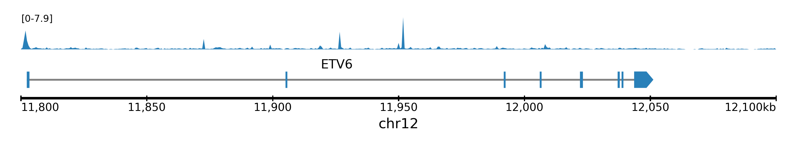
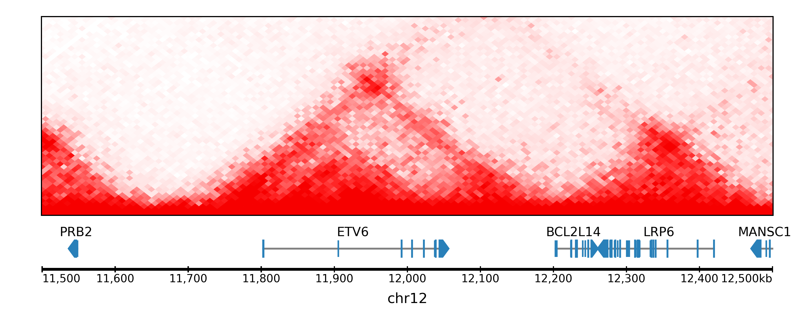
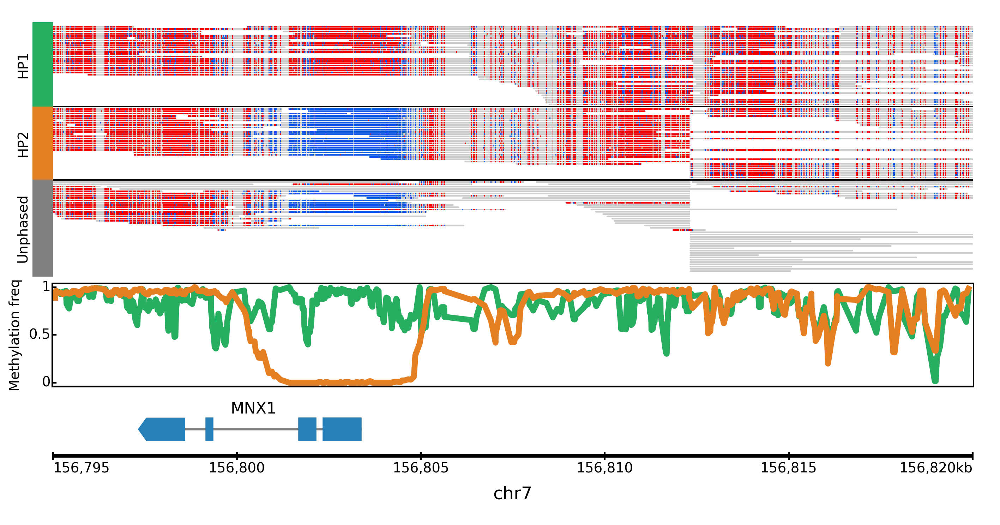
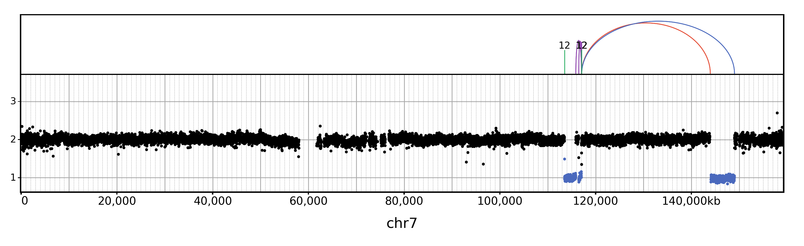
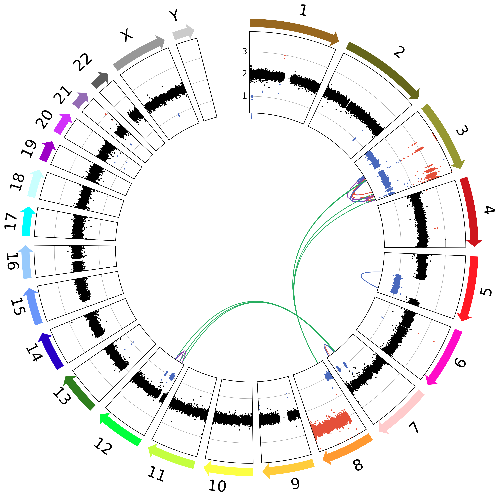
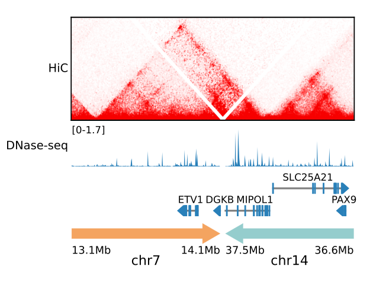
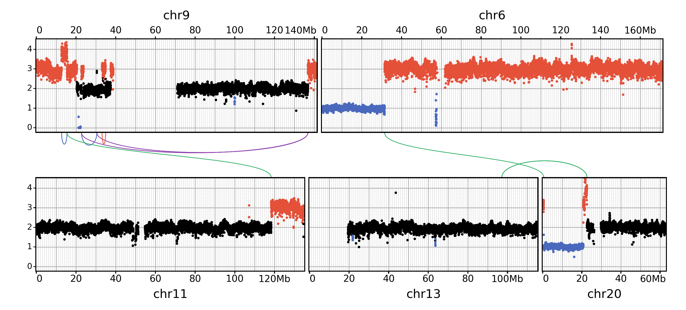

Examples
==================================

Templates
---------

You are free to combine tracks however you like, but to help you get started we provide premade templates which correspond to frequent use cases. These templates can be initialized by clicking on "Open template" in the gui or using :ref:`figeno init` in the command line

bigwig
^^^^^^

A simple template with a single bigwig track, as well a chr_axis and a genes track. You can of course add additional tracks after initializing this template.

.. toggle:: 
   
  .. code:: json
  
  	{
  		"general": {
  			"layout": "horizontal",
  			"reference": "hg19"
  		},
  		"output": {
  			"file": "figure_bigwig.png",
  			"dpi": 400,
  			"width": 180
  		},
  		"regions": [
  			{
  				"chr": "12",
  				"start": 11800000,
  				"end": 12100000,
  				"color": "#f4a460"
  			}
  		],
  		"highlights": [],
  		"tracks": [
  			{
  				"type": "bigwig",
  				"file": "/path/to/xxx.bigWig",
  				"height": 10,
  				"margin_above": 1.5,
  				"bounding_box": false,
  				"fontscale": 1,
  				"label": "",
  				"label_rotate": false,
  				"color": "#2980b9",
  				"n_bins": 500,
  				"scale": "auto",
  				"scale_pos": "corner"
  			},
  			{
  				"type": "genes",
  				"height": 10,
  				"margin_above": 1.5,
  				"bounding_box": false,
  				"fontscale": 1,
  				"label": "",
  				"label_rotate": false,
  				"style": "default",
  				"collapsed": true,
  				"only_protein_coding": true,
  				"exon_color": "#2980b9",
  				"genes": "auto"
  			},
  			{
  				"type": "chr_axis",
  				"height": 10,
  				"margin_above": 1.5,
  				"bounding_box": false,
  				"fontscale": 1,
  				"label": "",
  				"label_rotate": false,
  				"style": "default",
  				"unit": "kb",
  				"ticklabels_pos": "below",
  				"ticks_interval": "auto"
  			}
  		]
  	}

hic
^^^

A simple template with a single hic track (showing chromatin interactions from HiC data in .cool format), as well a chr_axis and a genes track. You can of course add additional tracks after inializing this template.

.. toggle:: 

  .. code:: json
  
  	{
  		"general": {
  			"layout": "horizontal",
  			"reference": "hg19"
  		},
  		"output": {
  			"file": "figure_hic.png",
  			"dpi": 400,
  			"width": 180
  		},
  		"regions": [
  			{
  				"chr": "12",
  				"start": 11500000,
  				"end": 12500000,
  				"color": "#f4a460"
  			}
  		],
  		"highlights": [],
  		"tracks": [
  			{
  				"type": "hic",
  				"file": "/path/to/xxx.cool",
  				"height": 50,
  				"margin_above": 1.5,
  				"bounding_box": true,
  				"fontscale": 1,
  				"label": "",
  				"label_rotate": false,
  				"color_map": "red",
  				"pixel_border": false,
  				"upside_down": false,
  				"max_dist": 700,
  				"extend": true,
  				"interactions_across_regions": true,
  				"double_interactions_across_regions": true
  			},
  			{
  				"type": "genes",
  				"height": 10,
  				"margin_above": 1.5,
  				"bounding_box": false,
  				"fontscale": 1,
  				"label": "",
  				"label_rotate": false,
  				"style": "default",
  				"collapsed": true,
  				"only_protein_coding": true,
  				"exon_color": "#2980b9",
  				"genes": "auto"
  			},
  			{
  				"type": "chr_axis",
  				"height": 10,
  				"margin_above": 1.5,
  				"bounding_box": false,
  				"fontscale": 1,
  				"label": "",
  				"label_rotate": false,
  				"style": "default",
  				"unit": "kb",
  				"ticklabels_pos": "below",
  				"ticks_interval": "auto"
  			}
  		]
  	}

asm
^^^

Allele-specific methylation: show the alignments colored by methylation and split by haplotype, as well as the methylation frequency split by haplotype.

.. toggle:: 

  .. code:: json
  
  	{
  		"general": {
  			"layout": "horizontal",
  			"reference": "hg19"
  		},
  		"output": {
  			"file": "template_asm.png",
  			"dpi": 400,
  			"width": 180
  		},
  		"regions": [
  			{
  				"chr": "7",
  				"start": 156795000,
  				"end": 156820000,
  				"color": "#f4a460"
  			}
  		],
  		"highlights": [],
  		"tracks": [
  			{
  				"type": "alignments",
  				"file": "/path/to/xxx.bam",
  				"height": 50,
  				"margin_above": 1.5,
  				"bounding_box": false,
  				"fontscale": 1,
  				"label": "",
  				"label_rotate": false,
  				"hgap_bp": 30,
  				"vgap_frac": 0.3,
  				"read_color": "#cccccc",
  				"splitread_color": "#999999",
  				"link_splitreads": false,
  				"min_splitreads_breakpoints": 2,
  				"group_by": "haplotype",
  				"show_unphased": true,
  				"exchange_haplotypes": false,
  				"show_haplotype_colors": true,
  				"haplotype_colors": [
  					"#27ae60",
  					"#e67e22",
  					"#808080"
  				],
  				"haplotype_labels": [
  					"HP1",
  					"HP2",
  					"Unphased"
  				],
  				"color_by": "basemod",
  				"color_unmodified": "#0f57e5",
  				"basemods": [
  					[
  						"C",
  						"m",
  						"#f40202"
  					]
  				],
  				"fix_hardclip_basemod": false
  			},
  			{
  				"type": "basemod_freq",
  				"height": 20,
  				"margin_above": 1.5,
  				"bounding_box": true,
  				"fontscale": 1,
  				"label": "Methylation freq",
  				"label_rotate": true,
  				"bams": [
  					{
  						"file": "/path/to/xxx.bam",
  						"base": "C",
  						"mod": "m",
  						"min_coverage": 6,
  						"linewidth": 3,
  						"opacity": 1,
  						"fix_hardclip": false,
  						"split_by_haplotype": true,
  						"colors": [
  							"#27ae60",
  							"#e67e22"
  						]
  					}
  				]
  			},
  			{
  				"type": "genes",
  				"height": 10,
  				"margin_above": 1.5,
  				"bounding_box": false,
  				"fontscale": 1,
  				"label": "",
  				"label_rotate": false,
  				"style": "default",
  				"collapsed": true,
  				"only_protein_coding": true,
  				"exon_color": "#2980b9",
  				"genes": "auto"
  			},
  			{
  				"type": "chr_axis",
  				"height": 10,
  				"margin_above": 1.5,
  				"bounding_box": false,
  				"fontscale": 1,
  				"label": "",
  				"label_rotate": false,
  				"style": "default",
  				"unit": "kb",
  				"ticklabels_pos": "below",
  				"ticks_interval": "auto"
  			}
  		]
  	}
  
wgs_chr
^^^^^^^^

.. toggle:: 

  .. code:: json
  
  	{
  		"general": {
  			"layout": "horizontal",
  			"reference": "hg19"
  		},
  		"output": {
  			"dpi": 400,
  			"file": "template_wgs_chr.png",
  			"width": 180
  		},
  		"regions": [
  			{
  				"chr": "7",
  				"start": null,
  				"end": null,
  				"color": "#f4a460"
  			}
  		],
  		"highlights": [],
  		"tracks": [
  			{
  				"type": "sv",
  				"file": "/path/to/xxx_SV.vcf",
  				"height": 15,
  				"margin_above": 1.5,
  				"bounding_box": true,
  				"fontscale": 1,
  				"label": "",
  				"label_rotate": false,
  				"lw": "0.5",
  				"color_del": "#4a69bd",
  				"color_dup": "#e55039",
  				"color_t2t": "#8e44ad",
  				"color_h2h": "#8e44ad",
  				"color_trans": "#27ae60"
  			},
  			{
  				"type": "copynumber",
  				"height": 30,
  				"margin_above": 0,
  				"bounding_box": true,
  				"fontscale": 1,
  				"label": "",
  				"label_rotate": false,
  				"freec_ratios": "xxx_ratio.txt",
  				"freec_CNAs": "xxx_CNVs",
  				"purple_cn": "",
  				"genes": "",
  				"min_cn": "",
  				"max_cn": "",
  				"grid": true,
  				"grid_major": true,
  				"grid_minor": true,
  				"grid_cn": true,
  				"color_normal": "#000000",
  				"color_loss": "#4a69bd",
  				"color_gain": "#e55039",
  				"color_cnloh": "#f6b93b"
  			},
  			{
  				"type": "chr_axis",
  				"height": 10,
  				"margin_above": 0,
  				"bounding_box": false,
  				"fontscale": 1,
  				"label": "",
  				"label_rotate": false,
  				"style": "default",
  				"unit": "kb",
  				"ticklabels_pos": "below",
  				"ticks_interval": "auto"
  			}
  		]
  	}

wgs_circos
^^^^^^^^^^

.. toggle:: 

  .. code:: json
  
  	{
  		"general": {
  			"layout": "circular",
  			"reference": "hg19"
  		},
  		"output": {
  			"file": "",
  			"dpi": 400,
  			"width": 180
  		},
  		"regions": [
  			{"chr": "1","color": "#98671F"},
  			{"chr": "2","color": "#65661B"},
  			{"chr": "3""color": "#969833"},
  			{"chr": "4","color": "#CE151D"},
  			{"chr": "5","color": "#FF1A25"},
  			{"chr": "6","color": "#FF0BC8"},
  			{"chr": "7","color": "#FFCBCC"},
  			{"chr": "8","color": "#FF9931"},
  			{"chr": "9","color": "#FFCC3A"},
  			{"chr": "10","color": "#FCFF44"},
  			{"chr": "11","color": "#C4FF40"},
  			{"chr": "12","color": "#00FF3B"},
  			{"chr": "13","color": "#2F7F1E"},
  			{"chr": "14","color": "#2800C6"},
  			{"chr": "15","color": "#6A96FA"},
  			{"chr": "16","color": "#98CAFC"},
  			{"chr": "17","color": "#00FEFD"},
  			{"chr": "18","color": "#C9FFFE"},
  			{"chr": "19","color": "#9D00C6"},
  			{"chr": "20","color": "#D232FA"},
  			{"chr": "21","color": "#956DB5"},
  			{"chr": "22","color": "#5D5D5D"},
  			{"chr": "X","color": "#989898"},
  			{"chr": "Y","color": "#CBCBCB"}
  		],
  		"highlights": [],
  		"tracks": [
  			{
  				"type": "sv",
  				"file": "/path/to/xxx_SV.vcf",
  				"height": 15,
  				"margin_above": 1.5,
  				"bounding_box": true,
  				"fontscale": 1,
  				"label": "",
  				"label_rotate": false,
  				"lw": "0.5",
  				"color_del": "#4a69bd",
  				"color_dup": "#e55039",
  				"color_t2t": "#8e44ad",
  				"color_h2h": "#8e44ad",
  				"color_trans": "#27ae60"
  			},
  			{
  				"type": "copynumber",
  				"height": 30,
  				"margin_above": 0,
  				"bounding_box": true,
  				"fontscale": 1,
  				"label": "",
  				"label_rotate": false,
  				"freec_ratios": "xxx_ratio.txt",
  				"freec_CNAs": "xxx_CNVs",
  				"purple_cn": "",
  				"genes": "",
  				"min_cn": "",
  				"max_cn": 3.9,
  				"grid": true,
  				"grid_major": false,
  				"grid_minor": false,
  				"grid_cn": true,
  				"color_normal": "#000000",
  				"color_loss": "#4a69bd",
  				"color_gain": "#e55039",
  				"color_cnloh": "#f6b93b"
  			},
  			{
  				"type": "chr_axis",
  				"height": 10,
  				"margin_above": 0,
  				"bounding_box": false,
  				"fontscale": 1,
  				"label": "",
  				"label_rotate": false,
  				"style": "default",
  				"unit": "kb",
  				"ticklabels_pos": "below",
  				"ticks_interval": "auto"
  			}
  		]
  	}

    
Other examples
---------------

HiC data across breakpoints
^^^^^^^^^^^^^^^^^^^^^^^^^^^

If you have HiC data for a sample with a structural rearrangement, you can use several regions around the breakpoint to visualize chromatin interactions across this rearrangement. The data to replicate this figure can be found at https://github.com/CompEpigen/figeno/tree/main/test_data (files starting with LNCaP). 

.. toggle:: 

  .. code:: json

    {
    	"general": {
    		"layout": "horizontal",
    		"reference": "hg38"
    	},
    	"output": {
    		"dpi": 400,
    		"file": "LNCaP_figure.svg",
    		"width": 80
    	},
    	"regions": [
    		{
    			"chr": "7",
    			"start": 13100000,
    			"end": 14150000,
    			"color": "#f4a460"
    		},
    		{
    			"chr": "14",
    			"start": 37510000,
    			"end": 36600000,
    			"color": "#95CDCD"
    		}
    	],
    	"highlights": [],
    	"tracks": [
    		{
    			"type": "hic",
    			"height": 25,
    			"margin_above": 1.5,
    			"bounding_box": true,
    			"fontscale": 1,
    			"label": "HiC   ",
    			"label_rotate": false,
    			"file": "LNCaP_subset_hg38.cool",
    			"color_map": "red",
    			"pixel_border": false,
    			"upside_down": false,
    			"max_dist": "1300",
    			"extend": true,
    			"scale": "auto",
    			"scale_max_percentile": 90,
    			"show_colorbar": false,
    			"interactions_across_regions": true,
    			"double_interactions_across_regions": true
    		},
    		{
    			"type": "bigwig",
    			"height": 10,
    			"margin_above": 1.5,
    			"bounding_box": false,
    			"fontscale": 1,
    			"label": "DNase-seq",
    			"label_rotate": false,
    			"file": "LNCaP_ENCFF282KWR_subset.bigwig",
    			"color": "#2980b9",
    			"n_bins": 500,
    			"scale": "auto",
    			"scale_pos": "corner"
    		},
    		{
    			"type": "genes",
    			"height": 11,
    			"margin_above": 1.5,
    			"bounding_box": false,
    			"fontscale": 1,
    			"label": "",
    			"label_rotate": false,
    			"style": "default",
    			"collapsed": true,
    			"only_protein_coding": true,
    			"exon_color": "#2980b9",
    			"genes": "auto"
    		},
    		{
    			"type": "chr_axis",
    			"height": 10,
    			"margin_above": 1.5,
    			"bounding_box": false,
    			"fontscale": 0.8,
    			"label": "",
    			"label_rotate": false,
    			"style": "arrow",
    			"unit": "Mb",
    			"ticklabels_pos": "below",
    			"ticks_interval": "auto"
    		}
    	]
    }

Symmetrical layout for WGS
^^^^^^^^^^^^^^^^^^^^^^^^^^

For WGS data, you can use the "symmetrical" layout to show the copy-number data on two rows, with the SVs in between. The data to replicate this figure can be found at https://github.com/CompEpigen/figeno/tree/main/test_data (files starting with THP1). 

.. toggle:: 

  .. code:: json

    {
    	"general": {
    		"layout": "symmetrical",
    		"reference": "hg19"
    	},
    	"output": {
    		"dpi": 400,
    		"file": "THP1_symmetrical_figure.png",
    		"width": 180
    	},
    	"regions": [
    		{"chr": "9"},
    		{"chr": "6"},
    		{"chr": "11"},
    		{"chr": "13"},
    		{"chr": "20"}
    	],
    	"highlights": [],
    	"tracks": [
    		{
    			"type": "sv",
    			"height": 6,
    			"margin_above": 1.5,
    			"bounding_box": false,
    			"fontscale": 1,
    			"label": "",
    			"label_rotate": false,
    			"file": "THP1_SV.vcf",
    			"lw": "0.5",
    			"color_del": "#4a69bd",
    			"color_dup": "#e55039",
    			"color_t2t": "#8e44ad",
    			"color_h2h": "#8e44ad",
    			"color_trans": "#27ae60"
    		},
    		{
    			"type": "copynumber",
    			"height": 25,
    			"margin_above": 0,
    			"bounding_box": true,
    			"fontscale": 1,
    			"label": "",
    			"label_rotate": false,
    			"freec_ratios": "THP1_ratio.txt",
    			"freec_CNAs": "THP1_CNVs",
    			"purple_cn": "",
    			"genes": "",
    			"ploidy": "2",
    			"min_cn": "",
    			"max_cn": "4.5",
    			"grid": true,
    			"grid_major": true,
    			"grid_minor": true,
    			"grid_cn": true,
    			"marker_size": "0.7",
    			"color_normal": "#000000",
    			"color_loss": "#4a69bd",
    			"color_gain": "#e55039",
    			"color_cnloh": "#f6b93b"
    		},
    		{
    			"type": "chr_axis",
    			"height": 8,
    			"margin_above": 0,
    			"bounding_box": false,
    			"fontscale": 1,
    			"label": "",
    			"label_rotate": false,
    			"style": "default",
    			"unit": "Mb",
    			"ticklabels_pos": "below",
    			"ticks_interval": "20000000"
    		}
    	]
    }
  

   

