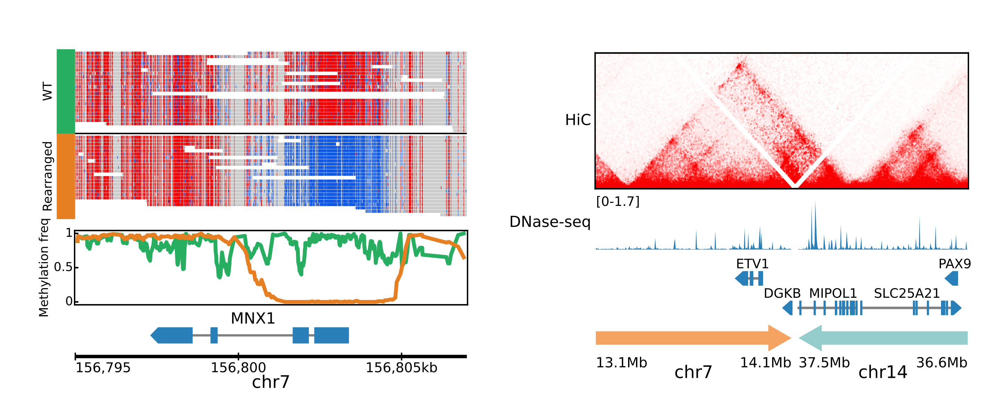

Welcome to figeno's documentation!
==================================

Figeno is a tool for generating **FI**\ gures for **GENO**\ mics.

Features
---------

* Large collection of tracks (bigwig, HiC, alignments, copy number, SV...)
* Graphical user interface
* Multi-region figures
* Highlight regions of interest
* Output figures in svg, pdf, eps or png

Table of contents
-----------------

.. toctree::
   :maxdepth: 2
   
   content/installation
   content/usage
   content/describe_figure
   content/examples

